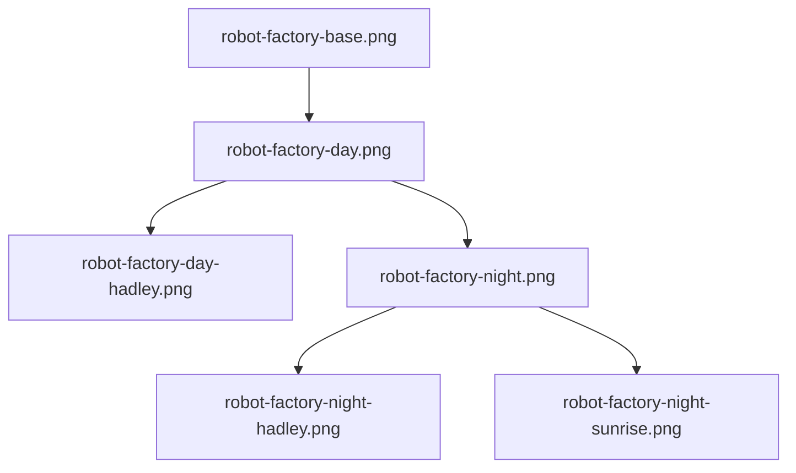
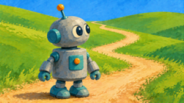
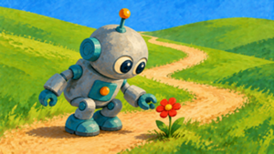
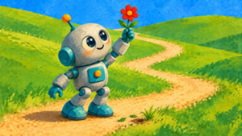
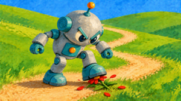

# Sequences

Sometimes you don’t want a set of independent images — you want a series
of images that build on one another, like the panels of a story.
bananarama supports this with `sequence`: each step generates a new
image by editing the previous step. This greatly improves consistency,
but YMMV; current models are still not great at this. (But, at least as
of Sept 2026, GPT models seemed to do better than Gemini models.)

## YAML syntax

To create a chain of images that build on one another, use a `sequence`
instead of `description`. The top-level `sequence` is a chain: each step
edits the previous step’s output, and every intermediate is saved as a
file:

``` yaml
defaults:
  model: gpt-image-2.5-flare

images:
  - name: robot-factory
    sequence:
      - name: base
        description: Draw a factory full of robots typing at computers.
      - name: hadley
        description: Add [hadley] overseeing the scene from a catwalk.
      - name: night
        description: Make it night time, with the robots' screens glowing.
```

This generates `robot-factory-base.png`, `robot-factory-hadley.png`, and
`robot-factory-night.png`, each building on the previous file.

## Branching

A step may itself contain `images`: independent continuations that each
build on the step’s image, not on each other. (Just like the top-level
`images` field, siblings are independent.) `sequence` and `images` can
be nested arbitrarily: a `sequence` inside `images` gives a chain within
a branch, and `images` inside a `sequence` step gives branches off that
step.

Here’s a simple example:

``` yaml
images:
  - name: robot-factory
    sequence:
      - name: base
        description: Draw a factory full of robots typing at computers.
      - name: day
        description: Make it a bright sunny day.
        images:
          - name: hadley
            description: Add [hadley] on the catwalk.
      - name: night
        description: Make it night time.
        images:
          - name: hadley
            description: Add [hadley] on the catwalk, screens glowing.
          - name: sunrise
            description: The sun starts to rise on the horizon.
```

This will generate the following six files:



Every step is cached independently, so you can iterate on later steps
without paying to regenerate earlier ones. Delete a step’s file and
re-run, and only that step is regenerated — the rest of the files are
reused as-is.

## Example: telling a story

This example tells a short story across a sequence of images. Because it
uses a sequence we don’t need to anchor with a reference image to make
the main character look the same in every panel. (But if we were to
regenerate all the images, we’d get a different robot.)

``` yaml
defaults:
  model: gpt-image-2.5-flare
  style: >
    Chunky gouache illustration with opaque matte colors, visible brushwork,
    bold simplified shapes, and a mid-century children's book feel

images:
  - name: robot-story
    sequence:
      - name: meadow
        description: >
          A quiet meadow with rolling green hills and a single winding
          dirt path under a blue sky.
      - name: robot
        description: >
          Add a small curious robot, standing on the path near the front of the 
          frame and looking around at the hills.
      - name: zoom
        description: >
          Zoom in on the robot, 
      - name: flower
        description: >
          The robot discovers a single bright red flower growing beside the
          path and bends down to look at it.
        images:
          - name: careful
            description: >
              The robot carefully picks the flower and holds it up towards
              the sky. The robot looks happy.
          - name: stomp
            description: >
              The robot stomps on the flower. The robot looks angry.
```

First we establish the scene:


Then introduce the main character:


Now we zoom in, preserving the existing imagery:



Then the robot finds a flower.



The last step has nested `images`, generating two alternative endings:




