# Styles

To help get your create juices flowing, this vignette shows a banana
rendered in a variety of styles. You can find the complete source in
[`styles.yml`](https://github.com/hadley/bananarama/blob/main/vignettes/articles/styles.yml).

## art-nouveau

*Art Nouveau decorative illustration with sinuous organic lines,
ornamental border motifs, muted jewel-tone palette, and elegant
typographic sensibility.*

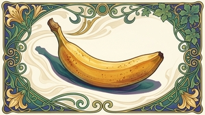

## claymation

*Stop-motion claymation with visible fingerprints in soft modeling clay,
rounded chunky forms, slightly wobbly edges, warm studio lighting, and a
shallow depth of field*

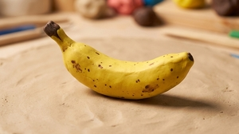

## copic

*Loose Copic marker sketch with expressive ink outlines, visible broad
alcohol-marker strokes, layering for shading, and a vibrant concept-art
aesthetic*

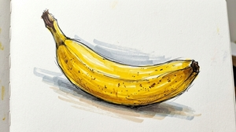

## embroidery

*Hand embroidery on linen with visible thread texture, satin stitch
fills, French knot accents, and a cozy handcraft aesthetic*

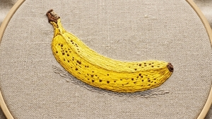

## folk-art

*Scandinavian folk art with symmetrical floral motifs, warm red and blue
palette on a cream background, flat decorative shapes, and hand-painted
charm*

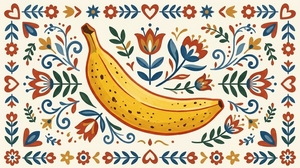

## gouache

*Chunky gouache illustration with opaque matte colors, visible
brushwork, bold simplified shapes, and a mid-century children’s book
feel*

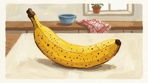

## inkwash

*Delicate Chinese ink wash painting with masterful negative space,
graduated ink tones, calligraphic brushwork, and poetic minimalism.*

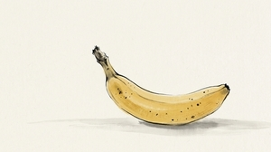

## isometric

*Clean isometric 3D illustration with flat shading, pastel color
palette, precise geometric angles, and a modern infographic aesthetic.*

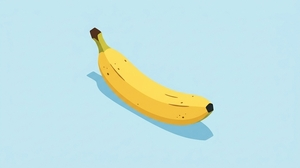

## memphis

*Corporate Memphis illustration with flat oversized shapes, simple
rounded forms, bright but muted primary colors, minimal detail, and the
cheerful generic style of Silicon Valley tech marketing. Plain
background*

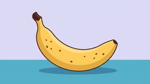

## mosaic

*Ancient Roman mosaic with small tessera tiles, earthy terracotta and
ochre palette, slightly irregular grid, and the textured look of stone
and ceramic fragments*

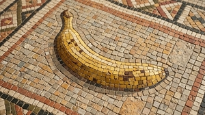

## neon

*Glowing neon sign against a dark brick wall, with bright tubular light,
subtle color spill on surrounding surfaces, and a warm nighttime
atmosphere*

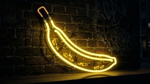

## oil-impasto

*Oil painting with vibrant colors and thick impasto brushstrokes, rich
texture, and saturated warm tones*

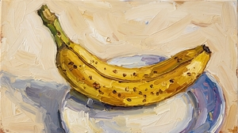

## papercut

*Papercut collage with layered construction paper shapes, visible cut
edges, bold flat colors, and subtle drop shadows between layers*

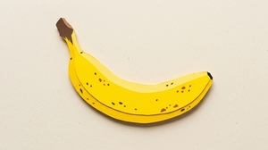

## pixel

*16-bit pixel art with a limited retro palette, crisp square pixels,
dithering for gradients, and a nostalgic video game aesthetic*

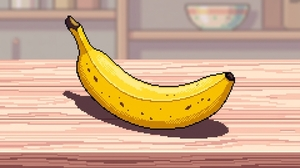

## pop-art

*Bold Pop Art in the style of Lichtenstein with Ben-Day dots, thick
black outlines, flat primary colors, and a comic-book panel
composition.*

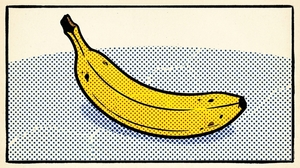

## risograph

*Risograph print aesthetic with slightly misregistered layers, limited
duotone or tritone palette, halftone dots, and characteristic grainy
texture.*

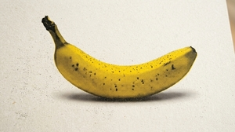

## stained-glass

*Stained glass window with thick dark leading lines, luminous
translucent color panels, geometric fragmentation, and the warm glow of
backlit glass*

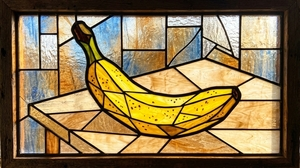

## watercolor

*Loose botanical watercolor with soft wet-on-wet bleeds, delicate
translucent washes, fine pencil underdrawing, and natural white paper
showing through*

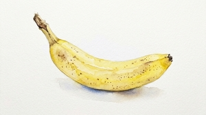

## woodblock

*Japanese ukiyo-e woodblock print with flat color planes, bold black
outlines, subtle wood grain texture, and traditional compositional
balance.*

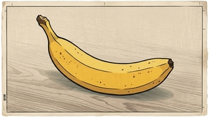
