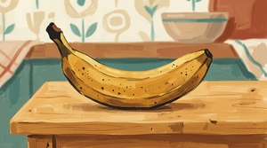
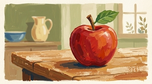
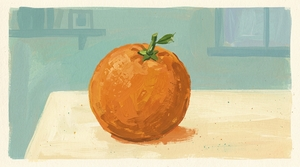
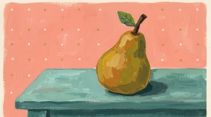
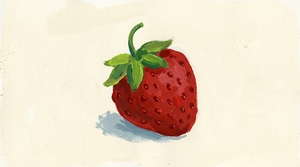
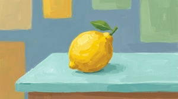

```{r}
#| include: false
knitr::opts_chunk$set(
  collapse = TRUE,
  comment = "#>"
)
```

Image generation is inherently stochastic: the same prompt can produce visibly different results each time. bananarama lets you control this with two YAML fields:

- **`n`**: generate multiple images from the same prompt.
- **`seed`**: pin the random seed for more reproducible output.

```{r}
#| eval: false
#| include: false
library(bananarama)
bananarama("randomness.yml")
bananarama:::resize_images("vignettes/articles/randomness")
```

## No seed

Without a seed, each image is generated independently and you'll see meaningful variation in composition, color, and detail.

::: {layout-ncol=3}


:::

## Setting a seed

Setting a seed encourages the model to produce more consistent output. There's much less variation between images compared to the unseeded set, event though results are not perfectly identical.

::: {layout-ncol=3}


:::

A different seed value produces a different but again more consistent set of images. Comparing this set with seed A shows that the seed affects the specific output, not just the consistency.

::: {layout-ncol=3}


:::

Unfortunately there's no way to determine what seed gemini uses if you don't specify one, so you can't reproduce unseeded results. If you want to be able to reproduce a specific image, you have to set a seed from the start.

## Seeds across different prompts

Note that a seed does not promote consistency across different prompts that share the same style. Here, six different fruits are each generated with the same seed and style, but each fruit looks producing a cohesive set despite the varying subjects:

::: {layout-ncol=3}











:::
