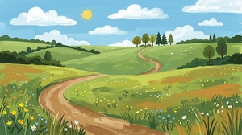
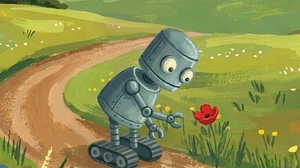
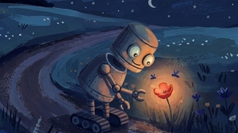

```{r}
#| include: false
knitr::opts_chunk$set(
  collapse = TRUE,
  comment = "#>"
)
```

Sometimes you don't want a set of independent images — you want a series of images that build on one another, like the panels of a story. bananarama supports this with `sequence`: each step generates a new image by editing the previous step's output, and every intermediate is saved as a file you can use.

## Chains

An image can have a `sequence` of steps instead of a single `description`. The top-level `sequence` is a chain: each step edits the previous step's output, and every intermediate is saved as a file:

```yaml
images:
  - name: robot-factory
    sequence:
      - name: base
        description: Draw a factory full of robots typing at computers.
      - name: hadley
        description: Add [hadley] overseeing the scene from a catwalk.
      - name: night
        description: Make it night time, with the robots' screens glowing.
```

This generates `robot-factory-base.png`, `robot-factory-hadley.png`, and `robot-factory-night.png`, each building on the previous file.

## Branching

A step may itself contain a `sequence`, which branches off that step's image — every child builds on the same parent image, not on each other. A step with both a `description` and a `sequence` produces its own image *and* serves as the starting point for its children; a step with only a `sequence` is a pure branch point:

```yaml
images:
  - name: robot-factory
    sequence:
      - name: base
        description: Draw a factory full of robots typing at computers.
      - name: day
        description: Make it a bright sunny day.
        sequence:
          - name: hadley
            description: Add [hadley] on the catwalk.
      - name: night
        description: Make it night time.
        sequence:
          - name: hadley
            description: Add [hadley] on the catwalk, screens glowing.
```

This produces `robot-factory-base.png`, `robot-factory-day.png`, `robot-factory-day-hadley.png`, `robot-factory-night.png`, and `robot-factory-night-hadley.png`, generating `base` only once.

## Rules

- Each step must have a `name`, unique among its siblings.
- Steps support `description`, `style`, `aspect-ratio`, `model`, and `seed` overrides. `resolution` and `n` can only be set at the top level of the image.
- With `n > 1`, each step generates `n` variants, and variant `i` of a step builds on variant `i` of its parent step.
- Generation is scheduled by dependency: a step runs as soon as its parent's file exists (cached or freshly generated), and everything that's ready runs in parallel.

## Caching

Every step is cached independently, so you can iterate on later steps without paying to regenerate earlier ones. Delete a step's file and re-run, and only that step (and anything building on it) is regenerated — the rest of the files are reused as-is.

## Example: telling a story

This example tells a short story across a sequence of images. It uses a reference image (`robot.png`) so the main character looks the same in every panel, plus a fixed `style` and `seed` in `defaults` to keep the look consistent:

```{verbatim, file="story.yml", lang="yaml"}
```

```{r}
#| include: false
library(bananarama)
bananarama("story.yml")
bananarama:::resize_images("story")
```

First we establish the scene:



Then introduce the main character. Because this step builds on the cached meadow image, the setting carries over:


Then the story beats: the robot finds a flower.



The `flower` step has both a `description` and a nested `sequence`, so its image is saved *and* two images branch off from it:

::: {layout-ncol=2}



:::
